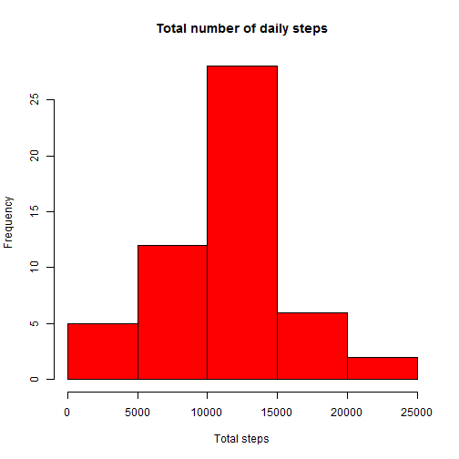
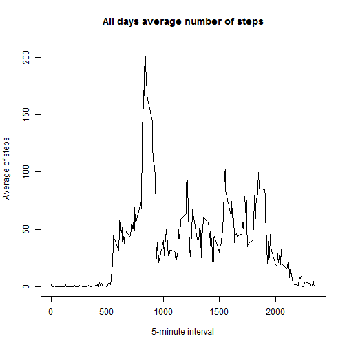
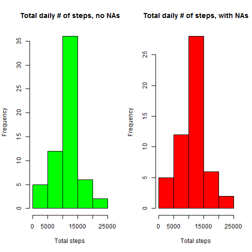
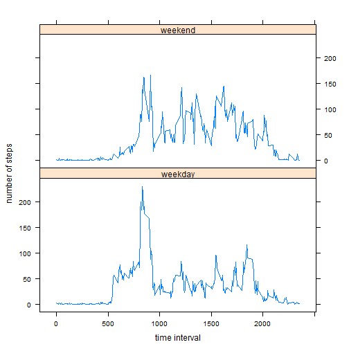

##Loading and preprocessing the data

----------------------------------

Show any code that is needed to:

1. Load the data (i.e. read.csv())

2. Process/transform the data (if necessary) into a format suitable for your analysis


```r
stepsData<- read.csv("activity.csv")
stepsData$date <- as.Date(stepsData$date)
```

## What is mean total number of steps taken per day?

For this part of the assignment, you can ignore the missing values in the dataset.

1. Make a histogram of the total number of steps taken each day

2. Calculate and report the mean and median total number of steps taken per day


```r
stepsCleanData <- stepsData[complete.cases(stepsData), ]

library(plyr)

stepsByDate <- ddply(stepsCleanData, ~date, summarize, sum = sum(steps))

hist(stepsByDate$sum, col = "red", xlab = "Total steps", main = "Total number of daily steps")
```

 


Mean total number of steps taken per day:

```r
stepsMean <- mean(stepsByDate$sum)
stepsMean
```

```
## [1] 10766.19
```

Median total number of steps taken per day:

```r
stepsMedian <- median(stepsByDate$sum)
stepsMedian
```

```
## [1] 10765
```


# What is the average daily activity pattern?

1. Make a time series plot (i.e. type = "l") of the 5-minute interval (x-axis) and the average number of steps taken, averaged across all days (y-axis)

2. Which 5-minute interval, on average across all the days in the dataset, contains the maximum number of steps?


```r
stepsBy5MinInterval <- ddply(stepsCleanData, ~interval, summarize, mean = mean(steps))
plot(stepsBy5MinInterval$interval, stepsBy5MinInterval$mean, type = "l", xlab = "5-minute interval", ylab = "Average of steps", main = "All days average number of steps")
```

 

```r
maxSteps <- max(stepsBy5MinInterval$mean)
maxSteps
```

```
## [1] 206.1698
```

Interval that contains the maximum number of steps:

```r
maxInterval <- stepsBy5MinInterval[stepsBy5MinInterval$mean == maxSteps, ]
maxInterval$interval
```

```
## [1] 835
```


# Imputing missing values

Note that there are a number of days/intervals where there are missing values (coded as NA). The presence of missing days may introduce bias into some calculations or summaries of the data.

1. Calculate and report the total number of missing values in the dataset (i.e. the total number of rows with NAs)

2. Devise a strategy for filling in all of the missing values in the dataset. The strategy does not need to be sophisticated. For example, you could use the mean/median for that day, or the mean for that 5-minute interval, etc.

3. Create a new dataset that is equal to the original dataset but with the missing data filled in.

4. Make a histogram of the total number of steps taken each day and Calculate and report the mean and median total number of steps taken per day. Do these values differ from the estimates from the first part of the assignment? What is the impact of imputing missing data on the estimates of the total daily number of steps?


Total number of missing values in the dataset:

```r
missData <- sum(is.na(stepsData$steps))
missData
```

```
## [1] 2304
```

To fill the missing values i'm using the mean for the 5 minute interval.

```r
filledData<-merge(stepsData, stepsBy5MinInterval, by = "interval")
filledData$steps[is.na(filledData$steps)]<- filledData$mean[is.na(filledData$steps)]
```

New dataset with all values filled in:

```r
fullStepsData<-filledData[, c(2, 3, 1)]
```


Histogram of the total number of steps, side-by-side with the original data histogram to observe differences:

```r
fullStepsByDate <- ddply(fullStepsData, ~date, summarize, sum = sum(steps))

par(mfrow = c(1,2))
hist(fullStepsByDate$sum, col = "green", xlab = "Total steps", main = "Total daily # of steps, no NAs")
hist(stepsByDate$sum, col = "red", xlab = "Total steps", main = "Total daily # of steps, with NAs")
```

 


Mean and median total number of steps taken per day

Mean:

```r
fullStepsMean <- mean(fullStepsByDate$sum)
fullStepsMean
```

```
## [1] 10766.19
```

Median:

```r
fullStepsMedian <- median(fullStepsByDate$sum)
fullStepsMedian
```

```
## [1] 10766.19
```

Are the values different? According to the calculation, not in a significant way.

We have the same mean and the median change is very small (=1).

Observing the above histograms, the distributions of total number of steps with or withouth NAs are similar.


# Are there differences in activity patterns between weekdays and weekends?

For this part the weekdays() function may be of some help here. Use the dataset with the filled-in missing values for this part.

1.Create a new factor variable in the dataset with two levels – “weekday” and “weekend” indicating whether a given date is a weekday or weekend day.

2.Make a panel plot containing a time series plot (i.e. type = "l") of the 5-minute interval (x-axis) and the average number of steps taken, averaged across all weekday days or weekend days (y-axis). See the README file in the GitHub repository to see an example of what this plot should look like using simulated data.


```r
fullStepsData$weekdayName<-weekdays(fullStepsData$date)

fullStepsData$weekdayType <- ifelse(fullStepsData$weekdayName == "Saturday" | fullStepsData$weekdayName == "Sunday", "weekend", "weekday")

fullStepsData$weekdayType <- factor(fullStepsData$weekdayType)

library(lattice)

stepsByIntervalAndWeekdayType <- ddply(fullStepsData, ~interval + weekdayType, summarize, mean = mean(steps))
stepsByIntervalAndWeekdayType$interval <- as.numeric(as.character(stepsByIntervalAndWeekdayType$interval))

xyplot(mean ~ interval | weekdayType, stepsByIntervalAndWeekdayType, 
       layout= c(1,2), type = "l", xlab = "time interval", ylab = "number of steps")
```

 

Looking at the plot, we can conclude that the activity patterns are similar, thought it looks like the weekend has a burst of more actvity in the middle of the time intervals. Probably people walk after lunch a bit more. :)

The end
